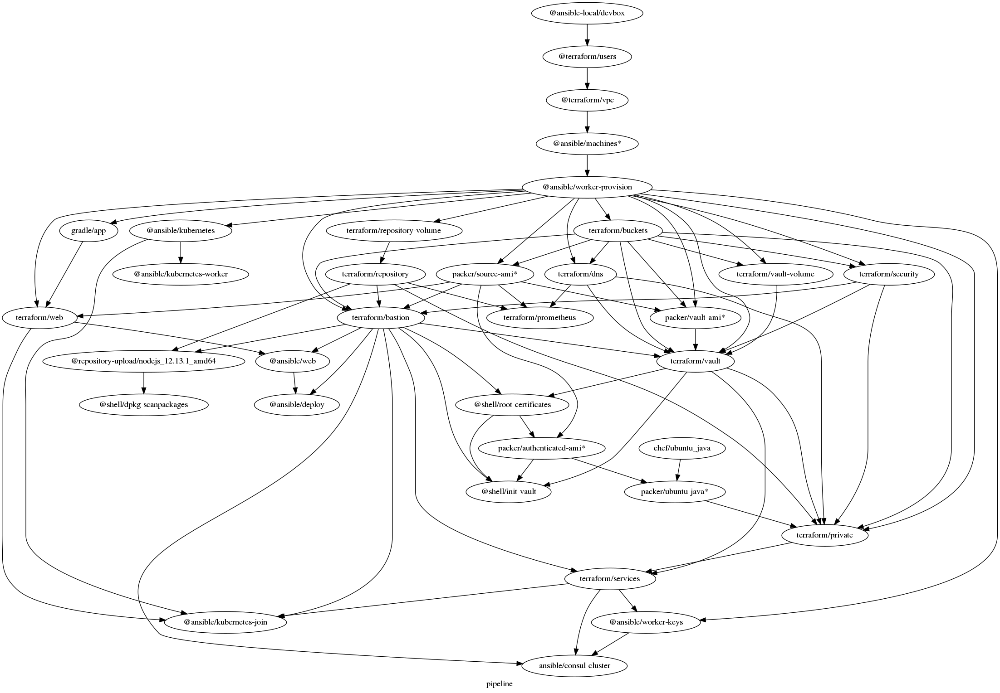
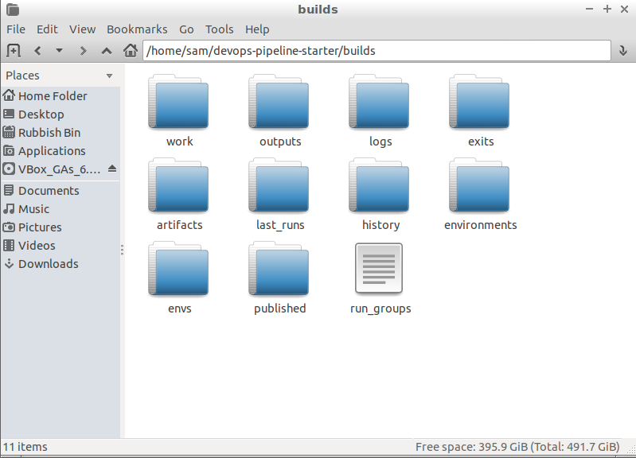

# introducing devops-pipeline - a devops pipelines as code tool

This is a prototype. YMMV

devops-pipeline is a command line tool to coordinate large complicated environments that are built from multiple devops tools. devops-pipeline is kind of a task runner and its web GUI is modelled to appear like a pipelined continuous integration server.

[See this project's Readme on Github](https://github.com/samsquire/devops-pipeline)

## infrastructure as code and pipelines as code

Write self-descriptive pipelines in dot syntax renderable by graphviz and executable by this tool. devops-pipeline uses [Graphviz dot file syntax](https://en.wikipedia.org/wiki/DOT_(graph_description_language)) for its configuration. In devops-pipeline, you **specify the order and dependencies of pipeline execution via flow of data between components**. Data passes between components via environment variables.

# parallel build execution

`devops-pipeline` knows what parts of your environment infrastructure can run together concurrently and in parallel due to its configuration being a graph file. Here is an example graph and GUI screenshot.

[](https://github.com/samsquire/devops-pipeline/blob/master/docs/architecture.tb.png)

This pipeline is fairly complicated environment that brings up two worker nodes with Ansible and provisions Hashicorp Vault with Terraform. Notice how some components such as dns, security, vault volume can all begin running at the same time as they are independent.

* Debian package repository server
* 2 CI build machines
* Prometheus instance for monitoring, monitoring via DNS
* Node exporter installed on base AMI
* Hashicorp Vault with Self signed Certificate authority for TLS
* bastion
* Kubernetes clustering
* Consul clustering


## Features


 * **Simple GUI** You can use the GUI to trigger builds of entire environments or individual components. Clicking Switch to Environment on an environment means you will only see components from that environment. You can see colourized console logs for component runs too.
 * **Fast builds** devops-pipeline only runs parts of your pipeline that need to run by detecting if they have been changed since the last run.
 * **Parallelisation** devops-pipeline knows what part of your infrastructure can run simultaneously, in parallel.
* **Scale out with SSH workers** Builds can be run on worker nodes to run builds on cloud machines. It is idiomatic devops-pipeline to spin up your worker nodes at the beginning of a pipeline. See below.
* **Secret handling** Encrypts sensitive outputs at rest with your GPG keys.
* **Progress bars** Devops-pipeline uses log size to calculate progress bars as a rough approximation of completedness.
* **Fire and forget builds** When devops-pipeline runs a project, it packages it for running in a different working directory. This means you can continue to make changes to your source tree without impacting the running build.
* **Search** Search for components and environments.
* **Automatic pipeline of variables** Devops-pipeline accumulates variables from outputs at different steps in your pipeline, so you never have to worry about if a a variable is in scope or not. As long as your step is downstream from another in the dot file, you'll be able to see the outputs at all levels above.
* **Build promotion** Builds will run through environments as according to environments.dot.

# introduction

`devops-pipeline` is for deterministically creating computer environments. An example environment is one that could use AWS, Terraform, Packer, shell scripts, Ansible, docker, Chef Inspec for testing. `devops-pipeline` allows you to chain together tools for running on your developer workstation. devops-pipeline models the flow of data between tools and uses environment variables to pass along data. devops-pipeline is meant to be used after each change whereby it runs validations, unit tests, smoke tests and deployments tests. devops-pipeline is meant to be ran after each and every change to your infrastructure code. You should be able to change any two parts of your infrastructure - at any layer - and test those changes together.

# how it works

devops-pipeline understands .dot files and interprets them to work out what must be done. All devops-pipeline does is walk the directories mentioned by your dot file and run a script inside each folder, named after the lifecycle stage. This is where you define what should happen for that stage of the pipeline. This is what gives devops-pipeline the flexibility to run any devops tool.

Your code is separated by directory by each tool. Like a **monorepository**, you divide your code by tool, so you have a directory for ansible code, a directory for terraform code. Devops-pipeline loops through these directories and runs a lifecycle command that you have in each code directory.

For example, you have the following code directories:

```
ansible/
shellscript/
terraform/
packer/
chef/
```

Devops-pipeline will cd to these directories and run a lifecycle command, which could be one of the following:

* ansible/validate -> ansible/run -> ansible/test
* shellscript/validate -> shellscript/run -> shellscript/test
* terraform/validate -> terraform/run -> terraform/test

# SSH workers

You don't always want to run builds on the master node (where you run devops-pipeline from) You can specify a list of hosts to run builds on remote servers **via SSH**.

```
devops-pipeline --file architecture.dot \
    --gui \
    --workers node1 node2 \
    --workers-key ~/.ssh/worker-ssh-key \
    --workers-user ubuntu
```

If you're provisioning worker nodes as part of  your pipeline, which is what we recommend, you can output the machine hostnames as an output and use `--discover-workers-from-output output-name`.

## idiom - provision SSH workers at the beginning of your pipeline

Unlike Jenkins and gocd, worker nodes are considered to be part of your pipeline. An idiom in `devops-pipeline` is that your early stages in your pipeline is provisioning worker nodes. These worker nodes run the remainder of the build. You can replace `--workers` with `--discover-workers-from-output <output name>` where `output name` is the name of an ouput from your machine provisioning component that contains a list of server hostnames or IP addresses that you can SSH onto.

Here is an example of ansible provisioning EC2 instances and installing dependencies on worker nodes, then running packer to build an AMI and launching that AMI with terraform.


The at symbol `@` at the beginning of a component reference means that this component builds on the master node.

```
digraph G {
	rankdir="LR";
	"@ansible/machines" -> "@ansible/provision-workers"-> "packer/source-ami" -> "terraform/appservers";
}
```

## idiom - building development workstations

An idiom is that developer workstations are provisioned by **devops-pipeline** which are your workstations you use for development.


```
digraph G {
	"@vagrant/devbox" -> "@ansible/workers" -> "@ansible/workers-provision";
}
```

### Example - building and using an AMI


file: architecture.dot
```
digraph G {
   rankdir="LR";
   "packer/ubuntu" -> "terraform/appserver";
}
```

In the above pipeline `packer/ubuntu` is a `component` that that uses packer to create machine images on AWS with Java installed. **packer/ubuntu outputs an AMI ID.** `terraform/appserver` is another component that needs this AMI ID to bring up a new instance running that AMI.

## Example - building and releasing a Java app


file: architecture.dot

```
digraph G {
  rankdir="LR";
  "ansible/machines" -> "gradle/app" -> "ansible/deploy" -> "ansible/release";
}
```
`ansible/machines` is a component that provisions machines running java.
`gradle/app` is a component that builds from source a Java app. One of `gradle/app`'s outputs is a path to an artifact; a set of jar files.


# quickstart

1. Ubuntu

Install ansible

```
sudo apt update
sudo apt install software-properties-common
sudo apt-add-repository --yes --update ppa:ansible/ansible
sudo apt install ansible
```

Install terraform with plugins

```
git clone git@github.com:samsquire/devops-pipeline.git
cd devops-pipeline
./install.sh  # adds devops-pipeline to your path via /etc/profile.d/devops-pipeline.sh
sudo apt-get install python3-pip
pip3 install -r requirements.txt
cd devops_pipeline/web ; npm install ; npm build
```

Create a GPG key

```
gpg --full-generate-key
```

2. Logout and log back in

```
git clone git@github.com:samsquire/devops-pipeline-starter.git
cd devops-pipeline-starter
```
2. Update ~/.aws/env to have the following. Upload a keypair to AWS using the AWS console.

```
AWS_ACCESS_KEY_ID=
AWS_SECRET_ACCESS_KEY=
```

3. Take a look around the demo project, which brings up 7 nodes in AWS. See architecture.dot to see how it fits together.

4. Update `common.tfvars` to include your key name, key path, IP address. Bring up demo project (this will cost money)

```
devops-pipeline home \
           --file architecture.dot \
	   --gui \
	   --discover-workers-from-output workers \
	   --workers-key <path to ssh private key> \
	   --workers-user ubuntu \
	   --keys <gpg key email> \
	   --rebuild 'packer/source-ami*' 'packer/authenticated-ami*' 'packer/vault-ami*' 'packer/ubuntu-java*'

```

Go to http://localhost:5000.
Click switch to environment under home and click 'Run pipeline'.
Check build/logs/* for errors


# passing data along a pipeline

Each life cycle command shell script is called with the environment variables:

 * `OUTPUT_PATH`
 * `EXIT_CODE_PATH`
 * `ARTIFACT_PATH`

The `OUTPUT_PATH` is an absolute path to a file that you should write outputs as a JSON file. The EXIT_CODE_PATH is where you should write an exit code of the lifecycle command. If it is 0 then the build is considered to be successful.

ARTIFACT_PATH is a path that you should save an archive of parts of your working directory to be `require`d from another pipeline.

Each time `devops-pipeline` runs a pipeline, it passes outputs of all upstream variables to to your pipeline command as environment variables.

# the builds directory



The `builds` directory is where logs and other outputs go:

* **outputs** output files that are aggregated
* **work** workspaces for builds, it's where the packaged repositories are unpacked
* **last_runs** a file to mark a run which is used to detect changes since the last run
* **history** a metadata file for each build, used to keep track of PIDs
* **exits** exit codes for each build
* **environments** environment files in json for each build
* **ens** environment files in bash
* **logs** Build logs

# depending on artifacts

To depend on an artifact, such as an archived workspace from a previous build (see ARTIFACT_PATH above) create a file called `require` in your root of a provider directory. It should contain the name of the pipeline to pull artifacts from and the words `latest` or `latestSuccessful`. Latest means the last created artifact and latestSuccessful means the last artifact that was a succeeding build.

For example, the following pulls in `gradle/app`

```
#!/bin/bash

ENV=$1

if [ -z $ENV ] ; then
  echo "need to provide environment name"
  exit 1
fi
shift

COMPONENT=$1
echo $COMPONENT >&2

if [ -z $COMPONENT ] ; then
  echo "need to provide component name"
  exit 1
fi
shift

if [[ "${COMPONENT}" == "deploy" ]]; then
  echo "gradle/app latestSuccessful"
fi

```


# why devops-pipeline

* Environments are complicated
* Knowledge of how bring up a new environment is not machine readable
* You want to make a change to a complicated system that will affect every thing, you need a repeatable way to test.
